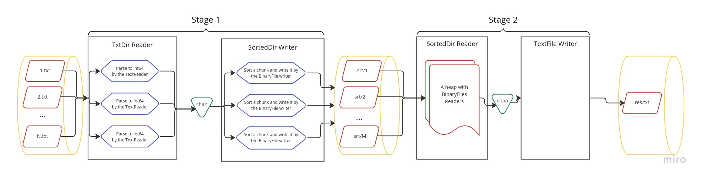

# Round 2

## Архитектура

### Базовые сущности:

1. **Reader**: читает любые данные и передаёт их в `chan int64`. В процессе может делать изменения и агрегации данных, в
   том числе и в несколько потоков.
2. **Writer**: читает данные из `chan int64` и записывает их в определённом виде на диск.
3. **Processor**: выполняет последовательность из пар Reader -> Writer (stage), умеет понимать какие последовательности
   были закончены, чтобы пропустить их при перезапуске оборванного выполнения.

Доступные Reader'ы и Writer'ы лежат в папке `taskio`:

1. **textfile**: читает и записывает числа из/в файл в текстовом формате.
2. **binaryfile**: читает и записывает числа из/в файл в бинарном формате (LittleEndian).
3. **txtdir**: читает все числа из всех `*.txt` файлов в директории за исключением файла `res.txt`. Делает чтение и
   конвертацию в несколько потоков.
4. **sorteddir**:
    - Writer разделяет входящий поток чисел на чанки, сортирует их в памяти и сохраняет на диск в бинарном виде.
      Работает в несколько потоков.
    - Reader открывает все файлы в директории c помощью `binaryfile` Reader'а, реализует ленивое чтение и организовывает
      их в min heap, что позволяет на выходе иметь поток отсортированных данных из всех файлов.
5. **uniq**: читает все числа из другого Reader'а и выдаёт только уникальные. Числа на вход должны быть отсортированы по
   возрастанию.
6. **heapfile**: реализован только Writer, точнее 2 Writer'а. Входящий поток разбивается на чанки, после заполнения
   чанка он преобразуется в min heap и записывается на диск в общий бинарный файл. Второй Writer - `FileFixer`,
   объединяет чанки в общую кучу уже на диске, по сути выполняя Heapify над данными в файле. Частично упорядоченные
   данные позволяют уменьшить количество обращений к диску. Также для IO реализован кэш, который позволяет ускорить
   процесс для данных на диске, уменьшив количество обращений к нему. Работает с 4Kb страницами.
7. **crc**, **rand**, **slice**: Reader'ы для тестов.

Все они реализуют интерфейсы:

```
type Reader interface {
    DataCh() <-chan int64
    Err() error
}

type Writer interface {
    WriteData(r Reader) error
}
```

### Пайплайны

#### -sort



#### -uniq

Практически такой же как и для `-sort`, отличается только добавлением Reader’а фильтра `uniq .Reader` на последнем
этапе.


#### -heap

Самая непонятная часть задачи. В принципе можно использовать вывод из режима `-sort`, т. к. упорядоченный массив
является валидной кучей. Моё решение данной задачи построено из условия, что надо максимально оптимизировать `Heapify`
на диске, т. к. данные только частично вмещаются в RAM.


## Makefile цели

- **build**: создаёт в папке `bin` следующие файлы:
    - **solution**: основное приложение — решение задачи.
    - **datagen**: приложение, позволяющее сгенерировать тестовые данные.
    - **heapcheck**: приложение, позволяющее проверить валидность кучи в текстовом файле.
- **test**: запускает Unit тесты.
- **e2etest**: запускает E2E тесты. В процессе работы используются следующие внешние приложения: `echo` для вывода
  сообщений, `sort` для проверки упорядоченности, `systemd-run` для запуска с ограничением по памяти (тестировалось на
  Ubuntu 22.04 LTS, на старых версиях может не работать). Для проверки отдельных режимов, можно использовать
  подцели `e2etest_sort`, `e2etest_uniq` и `e2etest_heap`. Для тестовых данных генерируется 499 999 файлов по 400
  строчек в каждом и 1 файл на 66 000 000 строк, что в сумме даёт чуть больше 5Gb. Данные хранятся в
  папке `.var/testdata`. Ограничение по памяти — 500Mb.
- **clean**: удаляет папки `.var` и `bin`.

## bin/solution

```
$ ./bin/solution -help
Usage of ./bin/solution:
  -dir string
        The directory with *.txt files (default ".")
  -heap
        Write "heapyfied" numbers in res.txt
  -mem-limit int
        Memory limit in Mb for sorting data, not whole application (default 380)
  -no-cleanup
        Do not remove temporary files
  -profile-cpu string
        A file for CPU pprof data
  -profile-mem string
        A file for Memory pprof data
  -sort
        Write sorted numbers in res.txt
  -uniq
        Write unique numbers in res.txt
```
